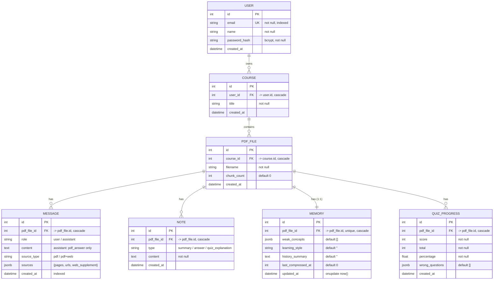

# Entity Relationship Diagram

Database: PostgreSQL · ORM: SQLAlchemy (`backend/models.py`) · 7 tables.

All foreign keys use `ON DELETE CASCADE`. Deleting a user cascades through
courses → pdf_files → messages / notes / memory / quiz_progress.

## Notes

- `MEMORY` is **1:1** with `PDF_FILE` (`pdf_file_id` is unique) — one conversation
  memory row per PDF.
- `MESSAGE`, `NOTE`, `QUIZ_PROGRESS` are **1:N** with `PDF_FILE`.
- `MESSAGE.sources` is a JSONB object `{pages, urls, web_supplement}`; for
  assistant rows, `content` holds the PDF answer and the web supplement lives in
  `sources.web_supplement` (see [ADR 0002](../adr/0002-llm-decided-web-search.md)).
- Ownership is always derived through the chain
  `record → pdf_file → course → user.id`; all queries are scoped by the
  authenticated user.
