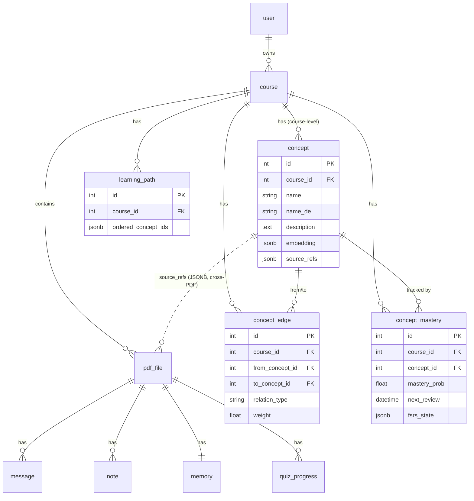

# 知识图谱数据库 Schema 设计

> **状态**: Draft (P7 设计文档)
> **更新**: 2026-06-20
> **作者**: EduPrep Team
> **关联文档**: [retrieval-flow.md](./retrieval-flow.md) · [concept-extraction-pipeline.md](./concept-extraction-pipeline.md) · ADR-0003 (图存储选型) · ADR-0004 (GraphRAG)

---

## 1. 设计目标与核心判断

EduPrep 的学习单位从 **PDF 级** 上升到 **课程级 (course)**。一个学期内，一门课会持续累积多份 PDF，而真正的"知识"和"学习状态"是贯穿整门课的：

- 同一个概念会在多份 PDF 中反复出现 → 必须是图谱里**一个节点**，回链到多份来源；
- 先修关系往往**跨 PDF**（第 9 周依赖第 3 周）→ 只有课程级才画得出来；
- "对某概念的掌握度"是贯穿整门课的状态，不属于任何单份 PDF。

**核心原则：物理文档层保留 PDF 级，知识层与学习者模型层上升到课程级。**

| 层 | 粒度 | 处理方式 |
|---|---|---|
| 文档层 (`pdf_file`, 切块, ChromaDB) | PDF 级 | **不变** |
| 对话 / 笔记 (`message`, `note`) | PDF 级 | **不变** |
| Preview 预习 | PDF 级 | **不变** |
| 知识图谱 (`concept`, `concept_edge`) | **课程级** | **新增** |
| 学习者模型 (`concept_mastery`) | **课程级** | **新增** |
| 学习路径 (`learning_path`) | **课程级** | **新增** |
| 薄弱概念 (`memory.weak_concepts`) | PDF 级 → 课程级 | **迁移** |

---

## 2. 现有 Schema（保留不变的部分）

来自 `backend/models.py`，7 张表中以下 6 张**完全保留**：

```
user           (id, email UK, name, password_hash, created_at)
course         (id, user_id FK→user, title, created_at)
pdf_file       (id, course_id FK→course, filename, chunk_count, created_at)
message        (id, pdf_file_id FK→pdf_file, role, content, source_type, sources JSONB, created_at)
note           (id, pdf_file_id FK→pdf_file, type, content, created_at)
quiz_progress  (id, pdf_file_id FK→pdf_file, score, total, percentage, wrong_questions JSONB, created_at)
```

`memory` 表保留，但其中的 `weak_concepts` 字段将被迁移（见 §5）：

```
memory  (id, pdf_file_id FK→pdf_file UK, weak_concepts JSONB,  ← 迁移到 concept_mastery
         learning_style, history_summary, last_compressed_at, updated_at)
```

> `memory` 表的 `history_summary` / `learning_style` / `last_compressed_at`（PDF 级对话记忆）继续保留并照常使用，**仅 `weak_concepts` 上升到课程级**。

---

## 3. 新增表（全部挂在 course 上）

### 3.1 `concept` — 课程级概念节点

知识图谱的节点。一个概念归属一门课程，并通过 `source_refs` 回链到**多份 PDF 的多个 chunk**——这是把零散 PDF 缝成网络的关键字段。

| 字段 | 类型 | 说明 |
|---|---|---|
| `id` | Integer PK | |
| `course_id` | Integer FK→course (CASCADE) | 课程级归属 |
| `name` | String(200) | 概念名（主语言，默认英文/中文） |
| `name_de` | String(200), nullable | 德语术语对照（接现有 vocabulary 能力） |
| `description` | Text, nullable | 概念简述（Claude 抽取生成） |
| `embedding` | JSONB / pgvector, nullable | 概念向量，用于实体消歧时的相似度比对 |
| `source_refs` | JSONB | 来源列表 `[{pdf_file_id, chunk_ids:[...]}]`，**支持跨 PDF** |
| `created_at` | DateTime | |
| `updated_at` | DateTime | 增量合并时更新 |

唯一约束建议：`(course_id, name)` 软唯一（消歧后保证课程内概念名不重复）。

### 3.2 `concept_edge` — 概念间关系边

| 字段 | 类型 | 说明 |
|---|---|---|
| `id` | Integer PK | |
| `course_id` | Integer FK→course (CASCADE) | 冗余存课程，便于按课程整图查询 |
| `from_concept_id` | Integer FK→concept (CASCADE) | |
| `to_concept_id` | Integer FK→concept (CASCADE) | |
| `relation_type` | String(20) | `prerequisite` / `related` / `part_of` / `equivalent_de` |
| `weight` | Float, default 1.0 | 关系强度（用于检索扩展排序、路径权重） |
| `created_at` | DateTime | |

唯一约束：`(from_concept_id, to_concept_id, relation_type)` 防重复边。

**关系类型语义**：

| relation_type | 含义 | 用途 |
|---|---|---|
| `prerequisite` | from 是 to 的先修 | 学习路径拓扑排序 |
| `related` | 相关/共现 | GraphRAG 检索扩展 |
| `part_of` | from 属于主题 to | 图谱分层/聚类 |
| `equivalent_de` | 德语术语等价 | 双语对照 |

### 3.3 `concept_mastery` — 课程级学习者模型

记录学习者对每个概念的掌握度 + FSRS 复习状态。**替代** `memory.weak_concepts`。

| 字段 | 类型 | 说明 |
|---|---|---|
| `id` | Integer PK | |
| `course_id` | Integer FK→course (CASCADE) | |
| `concept_id` | Integer FK→concept (CASCADE) | |
| `mastery_prob` | Float, default 0.0 | 掌握概率 [0,1]，知识追踪 (BKT) 更新 |
| `last_review` | DateTime, nullable | 上次复习时间 |
| `next_review` | DateTime, nullable | FSRS 计算的下次复习时间 |
| `fsrs_state` | JSONB, nullable | FSRS 内部状态 (stability, difficulty 等) |
| `updated_at` | DateTime | |

唯一约束：`(course_id, concept_id)` —— 每门课每个概念一行。

### 3.4 `learning_path` — 课程级学习路径

| 字段 | 类型 | 说明 |
|---|---|---|
| `id` | Integer PK | |
| `course_id` | Integer FK→course (CASCADE) | |
| `ordered_concept_ids` | JSONB | 拓扑排序后的概念 id 列表 |
| `generated_at` | DateTime | 生成时间（PDF 增量后可重新生成） |

### 3.5 `quiz_progress` 的小幅扩展

为支持"按概念追踪掌握度"，每道错题关联到概念。最小改动：保持 `wrong_questions` JSONB，但其中每个元素增加 `concept_id` 字段；如需强关联可新增中间表（P9 再定）。

---

## 4. ER 图改动（Mermaid）

新增部分以 `%% NEW` 标注。完整图后续导出为 `docs/architecture/er_diagram.svg`。



**级联删除**：删除 course → 级联删除 concept / concept_edge / concept_mastery / learning_path，与现有 `cascade="all, delete-orphan"` 风格一致。`concept` 与 `pdf_file` 之间是 JSONB 软引用（`source_refs`），不设外键，避免删除单份 PDF 时破坏图谱完整性（改为在删除 PDF 时清理对应 source_refs 条目）。

---

## 5. 迁移方案 (Alembic)

### 5.1 迁移目标

1. 新建 4 张表：`concept`、`concept_edge`、`concept_mastery`、`learning_path`；
2. 把 `memory.weak_concepts`（PDF 级 JSON 字符串数组）升级为课程级 `concept_mastery` 行；
3. `memory.weak_concepts` 字段**暂时保留**（标记 deprecated），确认稳定后再在后续迁移中删除——避免一步到位的风险。

### 5.2 迁移步骤

**Step 1 — 建表**（纯 additive，零风险）

```bash
cd backend
alembic revision -m "add knowledge graph tables (concept, concept_edge, concept_mastery, learning_path)"
# 在生成的迁移脚本 upgrade() 中 create_table 四张新表
alembic upgrade head
```

**Step 2 — 数据迁移**（一次性脚本 `migrate_weak_concepts.py`）

旧的 `weak_concepts` 是自由文本字符串数组，没有结构，因此迁移是"尽力而为"：

```
对每个 course:
    收集该课程下所有 pdf_file 的 memory.weak_concepts（去重）
    for 每个薄弱概念字符串:
        在 concept 表中查找/创建对应 concept（按 name 匹配，未来由抽取流水线规范化）
        在 concept_mastery 写入一行 (course_id, concept_id, mastery_prob=偏低初值如 0.3)
```

> 注意：旧 `weak_concepts` 是非结构化文本，迁移后的概念质量有限。**正式的高质量概念由 P7 的概念抽取流水线生成**，本次迁移只为不丢失历史薄弱信号、平滑过渡。

**Step 3 — 回填来源（可选，P7 抽取流水线上线后）**

概念抽取流水线跑完后，`concept.source_refs` 由抽取结果填充，迁移产生的"裸概念"会被合并/补全。

### 5.3 回滚

- `downgrade()` 删除 4 张新表；
- `memory.weak_concepts` 全程未删，回滚后旧逻辑仍可用。

---

## 6. 增量图谱构建（与本 schema 的关系）

图谱不是每次全量重建，而是随 PDF 上传**增量演进**（详见 [concept-extraction-pipeline.md](./concept-extraction-pipeline.md)）。本 schema 对增量的支持点：

1. **新 PDF 抽取概念** → 与课程已有 `concept` 做实体消歧（用 `concept.embedding` 相似度 + Claude 裁决）；
2. 命中已存在概念 → 仅向其 `source_refs` 追加一条 `{pdf_file_id, chunk_ids}`，**不新建节点**；
3. 新概念 → 插入 `concept` + 必要的 `concept_edge`；
4. `learning_path` 在显著变化后重新生成（不必每次）。

`source_refs` 为 JSONB 而非外键中间表，正是为支持这种"一个课程级概念回链多份 PDF、随时间增长"的场景，避免频繁的 schema 级写放大。

---

## 7. 对现有代码的影响清单

| 模块 | 影响 |
|---|---|
| `models.py` | 新增 4 个 ORM 类；`Course` 增加 4 个 relationship；`Memory.weak_concepts` 标记 deprecated |
| `memory.py` | 读取薄弱概念的逻辑从 `memory.weak_concepts` 改为查询 `concept_mastery`（课程级） |
| `main.py /quiz` | 出题时按 `course_id` 读 `concept_mastery` 而非按 filename 读 weak_concepts |
| `rag.py` | 新增 GraphRAG 检索分支（P8）：命中概念后按 `concept_edge` 扩展取 chunk |
| ChromaDB | **不变**（仍按 filename 分 collection），跨 PDF 检索通过 `source_refs` 协调 |
| Alembic | 新增 2 个迁移（建表 + 数据迁移脚本） |

---

## 8. 待决问题 (Open Questions)

- [ ] `concept.embedding` 用 JSONB 还是引入 **pgvector**？（建议起步 JSONB，规模上来后迁 pgvector，记入 ADR-0003）
- [ ] 图存储长期是否迁移到 Neo4j？多跳查询成为瓶颈时再评估（ADR-0003）
- [ ] `quiz_progress` 的概念关联用 JSONB 内嵌还是中间表？（P9 定）
- [ ] 跨课程的概念复用（同一概念出现在多门课）是否需要全局概念库？（暂不做，保持课程隔离）
```
